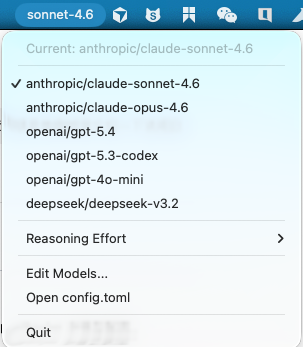
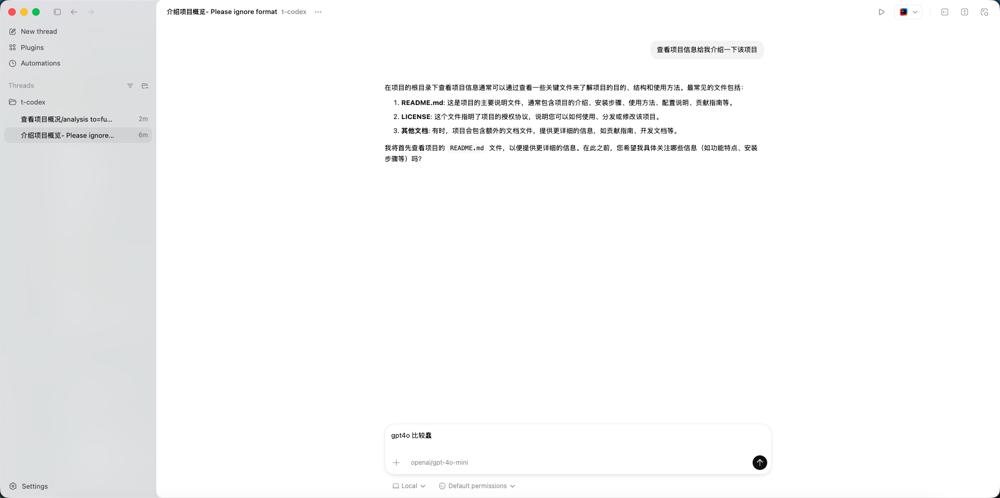
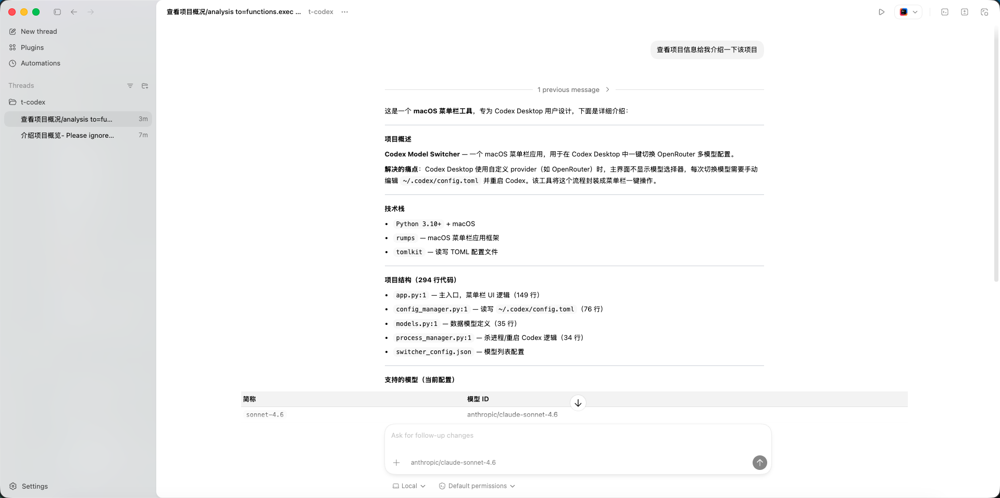

# Codex Model Switcher

[](LICENSE)
[](https://www.python.org)
[](https://www.apple.com/macos)
[](https://github.com/GitBiao/codex-switcher/releases)

**中文** | [English](README_EN.md)

macOS 菜单栏工具，用于在 [Codex Desktop](https://openai.com/index/introducing-codex/) 中一键切换 [OpenRouter](https://openrouter.ai/) 多模型配置。

## 背景

Codex Desktop 使用自定义 Provider（如 OpenRouter）时，主界面不显示模型选择器。每次切换模型需要手动编辑 `~/.codex/config.toml` 并重启应用。本工具将这一流程封装为菜单栏一键操作。

## 截图

<table>
  <tr>
    <td align="center"><b>菜单栏主界面</b></td>
    <td align="center"><b>切换到 GPT-4o</b></td>
    <td align="center"><b>切换到 Sonnet 4.6</b></td>
  </tr>
  <tr>
    <td></td>
    <td></td>
    <td></td>
  </tr>
</table>

## 快速开始

### 方式一：直接下载（推荐）

无需安装 Python 环境，下载即用：

1. 前往 [Releases 页面](https://github.com/GitBiao/codex-switcher/releases) 下载最新的 `Codex.Switcher.app.zip`
2. 解压后将 `Codex Switcher.app` 拖入 `/Applications` 目录
3. 设置环境变量（如尚未配置）：
   ```bash
   export OPENROUTER_API_KEY="sk-or-..."
   ```
4. 双击打开应用，菜单栏即出现模型切换器

> **提示**: 首次打开可能提示"无法验证开发者"，请前往 **系统设置 → 隐私与安全性** 点击"仍要打开"。

### 方式二：从源码运行

**1. 克隆并安装**

```bash
git clone https://github.com/GitBiao/codex-switcher.git
cd codex-switcher
pip3 install -r requirements.txt
```

**2. 设置环境变量**

```bash
export OPENROUTER_API_KEY="sk-or-..."
```

**3. 启动**

```bash
# 直接运行
python3 -m codex_switcher.app

# 或使用一键启动脚本（自动检测依赖）
./run.sh
```

**4. 构建 macOS .app（可选）**

```bash
make app
# 产物：dist/Codex Switcher.app
```

## 功能

- **一键切换模型** -- 菜单栏选择目标模型，自动更新配置并重启 Codex
- **Reasoning Effort 调节** -- 支持 low / medium / high / xhigh 四档
- **Dashboard 配置面板** -- pywebview 原生窗口，可视化管理模型、Provider 和默认参数
- **模型启用/禁用** -- 禁用的模型不出现在菜单栏，可在 Dashboard 中随时切换
- **macOS .app 打包** -- 通过 py2app 构建独立应用，双击即可运行
- **快速编辑** -- 直接打开 config.toml 编辑 Codex 配置
- **开机自启** -- 支持 macOS LaunchAgent 自动启动

## 目录结构

```
codex-switcher/
├── codex_switcher/              # 核心 Python 包
│   ├── __init__.py              # 版本号（__version__）
│   ├── app.py                   # 菜单栏应用主入口
│   ├── config_manager.py        # config.toml 读写
│   ├── dashboard.py             # Dashboard 配置面板（pywebview）
│   ├── models.py                # 模型配置管理
│   ├── process_manager.py       # Codex 进程生命周期管理
│   └── switcher_config.json     # 模型预设配置
├── docs/                        # 项目文档
│   ├── installation.md / installation_en.md
│   ├── usage.md / usage_en.md
│   ├── configuration.md / configuration_en.md
│   └── autostart.md / autostart_en.md
├── public/                      # 截图资源
│   ├── desc_gpt4o.png
│   ├── desc_sonnet4.6.png
│   └── switcher_main.png
├── resources/                   # 应用资源
│   ├── icon.icns                # macOS 应用图标
│   └── icon_1024.png            # 高清图标源文件
├── main.py                      # py2app 统一入口
├── setup.py                     # py2app 打包配置
├── Makefile                     # 构建命令（make app / make clean）
├── LICENSE                      # Apache License 2.0
├── README.md / README_EN.md     # 项目说明（中文 / English）
├── requirements.txt             # Python 依赖
└── run.sh                       # 一键启动脚本
```

## 文档

| 文档 | 说明 |
|------|------|
| [安装指南](docs/installation.md) | 直接下载、源码安装、环境变量配置、.app 构建 |
| [使用说明](docs/usage.md) | 启动方式、菜单操作、Dashboard、模型切换 |
| [配置详解](docs/configuration.md) | switcher_config.json 与 config.toml 字段说明 |
| [开机自启动](docs/autostart.md) | macOS LaunchAgent 配置方式 |

## 前提条件

1. macOS 系统
2. 已安装 [Codex Desktop](https://openai.com/index/introducing-codex/)（`/Applications/Codex.app`）
3. 已设置 `OPENROUTER_API_KEY` 环境变量（[获取 API Key](https://openrouter.ai/keys)）
4. 从源码运行时需要 Python 3.10+（直接下载 .app 无需 Python）

## 相关链接

- [OpenRouter Codex CLI 配置指南](https://openrouter.ai/docs/guides/coding-agents/codex-cli) -- OpenRouter 官方文档，介绍如何在 Codex CLI 中配置 OpenRouter 作为 Provider
- [Codex CLI GitHub](https://github.com/openai/codex) -- Codex CLI 开源仓库
- [OpenRouter 模型列表](https://openrouter.ai/models) -- 查看所有可用模型及其 ID

## Star History

[](https://star-history.com/#GitBiao/codex-switcher&Date)

## License

本项目基于 [Apache License 2.0](LICENSE) 开源。
